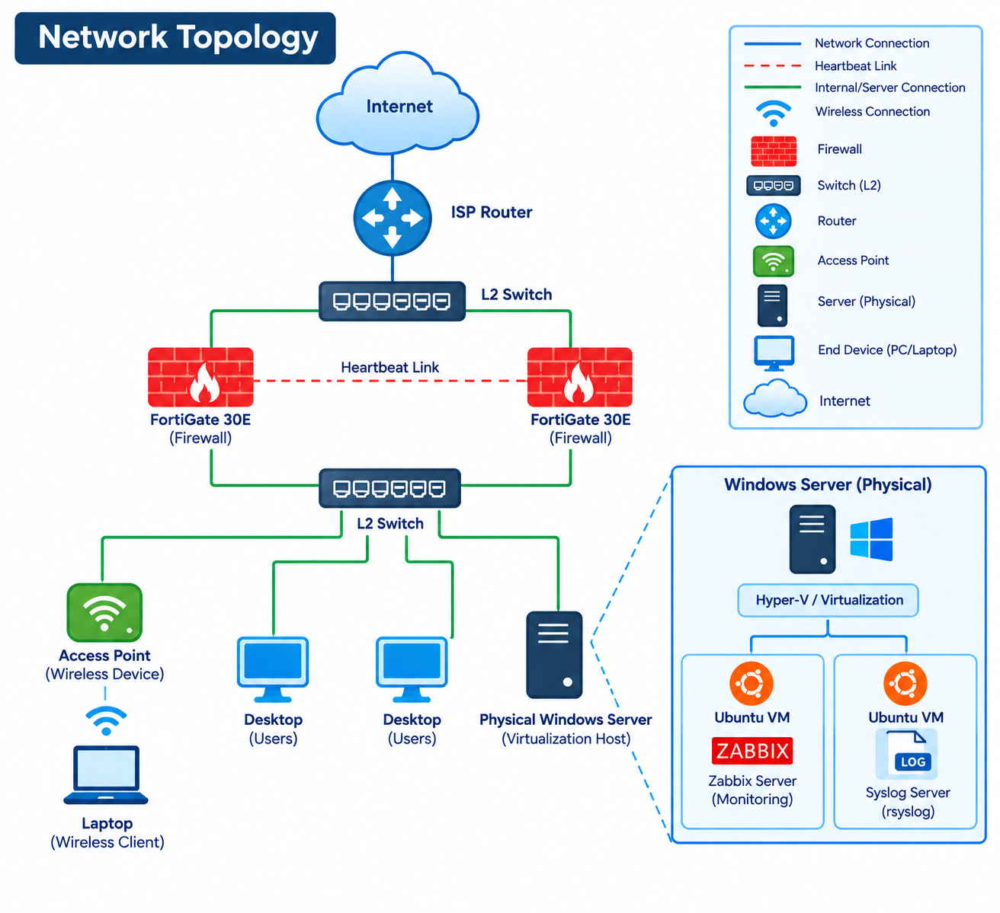

# Centralized Network Monitoring, Logging and Alerting System

## Overview

This project implements a centralized Network Monitoring, Logging, and Alerting System designed to provide visibility into network infrastructure, device performance, availability, system events, and security-related activities.

The solution uses **Zabbix** as the primary monitoring platform to monitor network infrastructure and detect operational issues. Network devices are monitored using **SNMP**, allowing the collection of performance and availability metrics.

In addition to SNMP monitoring, the project includes a centralized logging infrastructure. The same Linux machine thats runs the zabbix server is also configured as a **Syslog Server using rsyslog**, where network devices forward their system and security logs.

The collected Syslog messages are monitored to identify specific events, including login and authentication attempts. Zabbix triggers are configured based on relevant log patterns to detect predefined events and generate alerts.

When an infrastructure issue or security-related event is detected, Zabbix sends real-time notifications to a configured **Slack channel**.

The project is designed with future automation capabilities in mind. Integration with **Ansible** is planned as a future enhancement to enable automated diagnostics, event-driven automation, and potential remediation workflows.

---

# Project Objectives

The main objectives of this project are:

- Centralize network infrastructure monitoring.
- Monitor network device availability and performance.
- Collect monitoring data using SNMP.
- Detect infrastructure issues automatically.
- Centralize Syslog messages from network devices.
- Monitor login and authentication-related events.
- Generate triggers based on predefined monitoring and log conditions.
- Send real-time alerts to administrators through Slack.
- Reduce the need for continuous manual monitoring.
- Improve visibility into network and security events.

---

# System Architecture

The project consists of three main components:

1. Network infrastructure monitoring.
2. Centralized Syslog collection and event monitoring.
3. Real-time alert notifications.

```text
                            NETWORK INFRASTRUCTURE

                ┌──────────────┬──────────────┬──────────────┐
                │              │              │              │
            Firewalls      Servers   Virtual Machines  Wireless Devices (AP)
                │              │              │              │
                └──────────────┴──────────────┴──────────────┘
                                      │
                         ┌────────────┴────────────┐
                         │                         │
                        SNMP                     Syslog
                         │                         │
                         ▼                         ▼
                ┌─────────────────┐       ┌──────────────────┐
                │                 │       │                  │
                │     Zabbix      │       │   Linux Syslog   │
                │   Monitoring    │       │      Server      │
                │                 │       │    (rsyslog)     │
                └────────┬────────┘       └────────┬─────────┘
                         │                         │
                         │                  Log Collection
                         │                  & Monitoring
                         │                         │
                         └────────────┬────────────┘
                                      │
                                      ▼
                              ┌───────────────┐
                              │ Zabbix Events │
                              │   & Triggers  │
                              └───────┬───────┘
                                      │
                         ┌────────────┴────────────┐
                         │                         │
                         ▼                         ▼
                ┌───────────────┐          ┌───────────────┐
                │    Zabbix     │          |     Slack     |
                │   Dashboard   │          | Notifications |
                └───────────────┘          └───────────────┘
                
```

---
# Network Topology



---

# Technologies Used

| Technology | Purpose |
|---|---|
| Zabbix | Centralized infrastructure monitoring and alert management |
| SNMP | Collect monitoring information from network devices |
| Syslog | Collection of system and security events |
| Linux | Operating environment for monitoring and logging infrastructure |
| Slack | Real-time alert and notification delivery |

---

# Key Features

## Network Infrastructure Monitoring

The system provides centralized monitoring of network infrastructure devices.

Supported devices may include:

- Servers
- Firewalls
- Virtual Machines
- Wireless Access Points
- Other SNMP-enabled devices like Routers & Switches

The Zabbix dashboard provides a centralized view of the monitored infrastructure.

---

## SNMP-Based Monitoring

SNMP is used to collect monitoring information from supported network devices.

Monitoring metrics may include:

- Device availability
- ICMP ping status
- CPU utilization
- Memory utilization
- Disk utilization
- Interface status
- Interface traffic

This allows administrators to monitor device health and network performance from a centralized platform.

---

## Centralized Syslog Collection

Linux VM is configured as a centralized Syslog Server using **rsyslog**.

Network devices are configured to forward their Syslog messages to the Linux Syslog Server.

This allows system messages and events from multiple devices to be collected in a single location.

The centralized logging environment provides improved visibility into:

- System events
- Device status changes
- Authentication events
- Login attempts
- Failed authentication attempts
- Administrative activity
- Other security-related events

---

# Syslog Architecture

The Syslog collection process follows the workflow below:

```text
Network Devices
       │
       │ Generate Syslog Messages
       ▼
Network Communication
       │
       │ Syslog Protocol
       ▼
Linux Syslog Server
       │
       │ rsyslog
       ▼
Centralized Log Storage
       │
       ▼
Zabbix Log Monitoring
       │
       ▼
Event Detection
```

---

# Login and Authentication Monitoring

The centralized Syslog infrastructure is used to monitor login and authentication-related events generated by network devices.(In implementation I used only the FortiGate firewall logs and creating triggers based on that logs.)

Zabbix monitors relevant log messages and detects predefined patterns associated with authentication events.

Examples of monitored events may include:

- Login attempts
- Failed login attempts
- Authentication failures
- Successful administrative logins
- Multiple authentication attempts
- Unauthorized access attempts
- Suspicious login activity

When a predefined event pattern is detected, Zabbix can generate a trigger and create a problem event.

---

# Login Attempt Detection Workflow

```text
User Attempts Login
        │
        ▼
Network Device Generates Log Event
        │
        ▼
Syslog Message Generated
        │
        ▼
Message Sent to Linux Syslog Server
        │
        ▼
rsyslog Receives and Stores Log
        │
        ▼
Zabbix Monitors Relevant Log Entry
        │
        ▼
Matching Pattern Detected
        │
        ▼
Zabbix Trigger Activated
        │
        ▼
Slack Notification Sent
        │
        ▼
Administrator Receives Alert
```

---

# Zabbix Monitoring and Triggering

Zabbix is responsible for monitoring infrastructure metrics and detecting predefined problems.

Triggers are configured to generate alerts when specific conditions are met.

Examples include:

### Infrastructure Monitoring Triggers

- Network device unavailability
- High CPU utilization.
- High memory utilization.
- Network interface down.
- High Network usage.
- Service availability issues.

### Log-Based Triggers

- Login attempts detected.
- Failed login attempts.
- Authentication failures.
- Multiple authentication events.

---

# Alert and Notification System

When Zabbix detects a problem or predefined event, it generates an alert.

The alert is sent to a configured Slack channel, allowing administrators to receive notifications in real time.

The notification workflow is:

```text
Monitoring Event
       │
       ▼
Zabbix Detects Issue
       │
       ▼
Trigger Condition Met
       │
       ▼
Problem Event Created
       │
       ▼
Slack Notification Sent
       │
       ▼
Administrator Receives Alert
```

---

# Slack Integration

Slack is integrated with Zabbix to provide centralized and real-time alert notifications.

The integration helps administrators respond to incidents without continuously monitoring the Zabbix dashboard.

Notifications can provide information such as:

- Device hostname
- Problem name
- Event severity
- Trigger information
- Date and time
- Event status

Example:

```text
Alert from NMS
Problem: Linux: sda: Disk read/write request responses are too high on Zabbix server

Information:
Severity: Warning
Host: Zabbix server
Problem: Linux: sda: Disk read/write request responses are too high
Status: PROBLEM
Time: 2026.09.04 11:04:03

```
```text
Alert from NMS
Problem: FortiGate: Interface lan3(): Link down on BO-Firewall-S

Information:
Severity: Average
Host: BO-Firewall-S
Problem: FortiGate: Interface lan3(): Link down
Status: PROBLEM
Time: 2026.09.04 13:32:18

```


Security-related notifications can also be generated based on monitored Syslog events. In here the host is shown as Zabbix server becuase the syslog in runs on that, But when we definding the problem we can mention the specific device accordingly.

Example:

```text
Alert from NMS
Problem: Login_Faild_Via_SSH_on_FortiGateFW on Zabbix server

Information:
Severity: Warning
Host: Zabbix server
Problem: Login_Faild_Via_SSH_on_FortiGateFW
Status: PROBLEM
Time: 2026.09.04 13:52:54
```

---

# Monitoring Workflow

The complete monitoring workflow combines SNMP monitoring and centralized Syslog monitoring.

## Infrastructure Monitoring

```text
Network Device
      │
      │ SNMP
      ▼
Zabbix Server
      │
      ▼
Monitoring Data Processing
      │
      ▼
Trigger Evaluation
      │
      ▼
Problem Detected
      │
      ▼
Slack Notification
```

## Log Monitoring

```text
Network Device
      │
      │ Syslog
      ▼
Linux Syslog Server
      │
      │ rsyslog
      ▼
Centralized Log Storage
      │
      ▼
Zabbix Log Monitoring
      │
      ▼
Log Pattern Detected
      │
      ▼
Trigger Activated
      │
      ▼
Slack Notification
```

---

# Installation and Configuration

## Prerequisites

The following components are required for the implementation:

- Linux Server
- Zabbix Server, Agent and Fronend
- Web Server (Apache)
- Database for Zabbix(MySQL)
- SNMP and Syslog Capable Network devices
- rsyslog
- Slack Workspace
- Network connectivity between infrastructure components

---

# Zabbix Configuration

Zabbix is configured as the central monitoring platform.

The Zabbix server is responsible for:

- Collecting monitoring data.
- Processing SNMP metrics.
- Monitoring configured hosts.
- Evaluating triggers.
- Detecting problems.
- Generating events.
- Sending notifications.

---

# Adding Network Devices

Network devices can be added to Zabbix as monitored hosts.

General configuration steps:

1. Access the Zabbix web interface.
2. Create a new host.
3. Configure the device hostname.
4. Configure the device IP address.
5. Add an SNMP interface.
6. Configure SNMP community information.
7. Assign an appropriate monitoring template.
8. Save the host configuration.
9. Verify successful data collection.

---

# SNMP Configuration

SNMP must be enabled on network devices before monitoring.

General requirements include:

- Enable SNMP on the device.
- Configure the required SNMP version.
- Configure SNMP community strings.
- Allow communication from the Zabbix server.
- Configure firewall rules if required.
- Verify connectivity between the device and Zabbix server.

---

# Syslog Server Configuration

The same Linux machine which runs the zabbix server is configured as the centralized Syslog Server.

The server uses **rsyslog** to receive Syslog messages from network devices. In this implementation I store the FortiGate logs in seperate log file by filtering it using serail number.

General configuration requirements include:

- Install rsyslog.
- Enable network Syslog message reception.
- Configure the required transport protocol.
- Configure the listening port.
- Configure log storage locations.
- Configure network devices to forward logs to the Syslog server.
- Verify incoming Syslog messages.

The Syslog server acts as a centralized logging point for multiple network devices.

---

# Log Monitoring

The centralized Syslog files are monitored to identify relevant events.

Zabbix can monitor log files and identify specific patterns using configured items and triggers.

The monitoring logic can be represented as:

```text
Syslog Message Received
        │
        ▼
Log Written to File
        │
        ▼
Zabbix Monitors Log File
        │
        ▼
Pattern Matching
        │
        ├── No Match → Continue Monitoring
        │
        └── Match Found
                │
                ▼
          Trigger Activated
                │
                ▼
          Alert Generated
```

---

# Project Structure

```text
Network-Monitoring-System/
│
├── README.md
│
├── documentation/
│   ├── installation.md
│   ├── zabbix-configuration.md
│   ├── snmp-configuration.md
│   ├── syslog-configuration.md
│   └── slack-integration.md
│
├── architecture/
│   ├── network-topology.png
│   └── system-architecture.png
│
├── screenshots/
│   ├── zabbix-dashboard.png
│   ├── host-monitoring.png
│   ├── problems.png
│   ├── syslog-server.png
│   ├── login-trigger.png
│   └── slack-alert.png
│
├── zabbix/
│   ├── templates/
│   ├── triggers/
│   └── configurations/
│
├── syslog/
│   └── rsyslog-configurations/
│
└── 
```

---

# Screenshots

## Zabbix Dashboard

Add a screenshot showing the centralized monitoring dashboard.

```text
screenshots/zabbix-dashboard.png
```


---

## Network Device Monitoring

Add screenshots showing monitored network devices.

```text
screenshots/host-monitoring.png
```


---

## Problems and Triggers

Add screenshots showing active problems and configured triggers.

```text
screenshots/problems.png
```


---

## Syslog Server

Add a screenshot showing incoming Syslog messages on the Linux server.

```text
screenshots/syslog-server.png
```


---

## Login Attempt Detection

Add a screenshot showing the Zabbix trigger or event generated from a login-related Syslog message.

```text
screenshots/login-trigger.png
```


---

## Slack Notifications

Add a screenshot showing a notification sent from Zabbix to Slack.

```text
screenshots/slack-alert.png
```


---

# Skills Demonstrated

This project demonstrates practical experience with:

- Network Monitoring
- Zabbix Administration
- SNMP
- Network Infrastructure Monitoring
- Linux Administration
- rsyslog
- Syslog Management
- Centralized Logging
- Log Monitoring
- Event Detection
- Authentication Monitoring
- Security Event Monitoring
- Trigger Configuration
- Alert Management
- Slack Integration
- Incident Detection

---

# Learning Outcomes

Through this project, I gained hands-on experience in:

- Deploying a centralized monitoring solution.
- Monitoring network infrastructure using Zabbix.
- Configuring SNMP-based monitoring.
- Managing hosts and templates.
- Creating monitoring items and triggers.
- Detecting infrastructure problems.
- Deploying a centralized Syslog server.
- Configuring rsyslog for log collection.
- Forwarding network device logs to a centralized server.
- Monitoring Syslog messages.
- Detecting login and authentication-related events.
- Creating log-based triggers.
- Configuring real-time notifications.
- Integrating Zabbix with Slack.
- Understanding the relationship between monitoring, logging, security events, and automation.
- Designing a foundation for future event-driven automation.

---

# Project Status

🟢 **Active Development**

| Project Phase | Status |
|---|---|
| Zabbix Monitoring Infrastructure | Completed |
| SNMP Device Monitoring | Completed |
| Zabbix Triggers and Problem Detection | Completed |
| Slack Notification Integration | Completed |
| Centralized Syslog Server | Completed |
| rsyslog Configuration | Completed |
| Login Attempt Detection | Completed |
| Log-Based Event Monitoring | Completed |
| Ansible Integration | Planned |
| Event-Driven Automation | Planned |

---

# Author

**Anushka Madushan**

Network | Infrastructure | Monitoring | Automation

---

# License

This project is created for educational, learning, and portfolio purposes.
