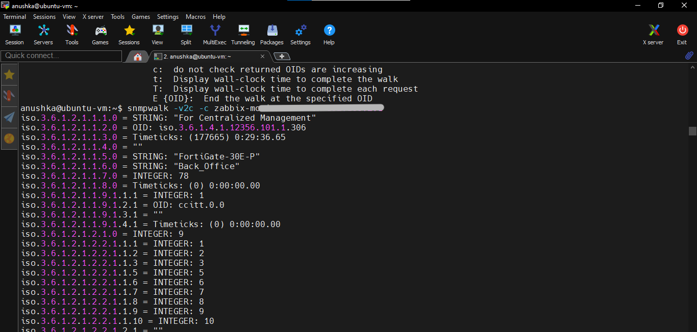

# Adding a Host to Zabbix

## Overview

This document provides the common steps required to add and configure a host in the Zabbix Network Monitoring System (NMS).

A host in Zabbix represents a physical device, virtual machine, server, network device, or other infrastructure component that needs to be monitored.

Depending on the device type, Zabbix can collect monitoring data using:

- Zabbix Agent
- SNMP
- ICMP Ping
- IPMI
- JMX

For network devices such as firewalls, switches, routers, and wireless devices, SNMP is commonly used.

---

# Prerequisites

Before adding a host to Zabbix, ensure the following requirements are met:

- The device is reachable from the Zabbix server.
- The correct IP address or hostname is available.
- Required monitoring protocols are enabled.
- SNMP is configured if SNMP monitoring is required.
- Firewall rules allow communication between the Zabbix server and the target device.
- Appropriate Zabbix templates are available. If not can download trough the zabbix repository --> https://git.zabbix.com/projects/ZBX/repos/zabbix/browse/templates

---

## Step 1: Access the Zabbix Web Interface

Log in to the Zabbix frontend using autherized credentials.

Navigate to Data Collection > Host > create Host

---

## Step 2: Configure Host Information

Then we have to configure basic informations like:

   **Host name** - unique name used to identify the device in Zabbix.

   **Visible name** - same as the Host name by default.

   **Templates** - we need to choose the correct template of import a new one because it should match with the device type and monitoring method. Template include the monitoring items, triggers, graphs and discovery rules. As a example for FortiGate firewalls we use "FortiGate by SNMP" template.

   **Host Group** - we can create new host group or assign to an existing one.

   **Interface** - we can add interface by using zabbix agent or as a SNMP interface accordingly, and giving the correct IP address and ports. If used SNMP need to give correct communitiy string if we use SNMP version 2 in here.

---

## Step 3: Configure Monitoring Settings

Review and configure additional settings if required.

These may include:

  - Monitoring enable/disable settings
  - Inventory mode
  - Tags (can use to organizing events and alerts)
  - Encryption
  - Host interface
  - Custom macros

---

## Step 4: Save the Host

Click add button to add the host to zabbix host list.

---

## Step 5: Verify Host Availability

Go to Monitoring > Hosts and verify if the host availability status is indicate in green color, based on SNMP or zabbix agent. Also we can execute ping if we enable globale script execution from zabbix serevr configurations.

---

## Step 6: Verify Collected Data and Triggers

Go to the Monitoring > Latest Data and verify the monitoring data are collecing or not. And go to the Data collection > Host and verify the triggers from assign template are active or not.

---

# Troubleshooting

If device is not showing as correctly monitoring:

   - check the connectivity between device and zabbix server. Execute ping from the server side.
   - Test SNMP communication from the zabbix server. Used "snmpwalk -<v2c -c <community_string> <device_IP>" command by given correct SNMP version, community string and IP address. Following screenshot provide an example.

   

   - If firewalla are enabled verify required ports are allowed.
   - checks the zabbix server logs for communicating or configuration errors.

