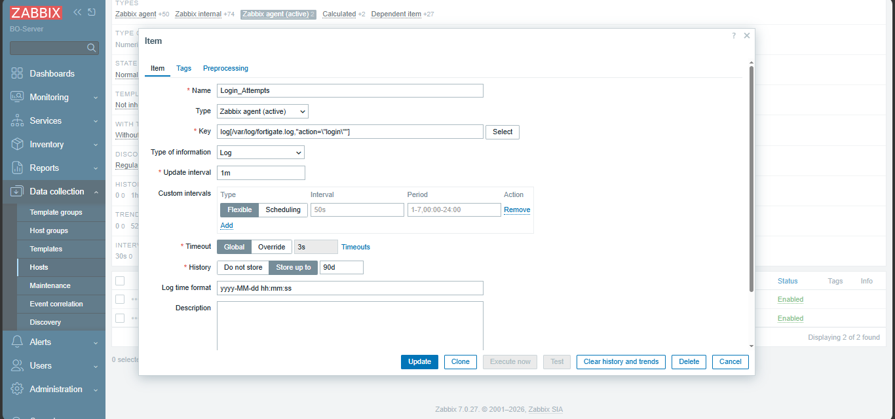
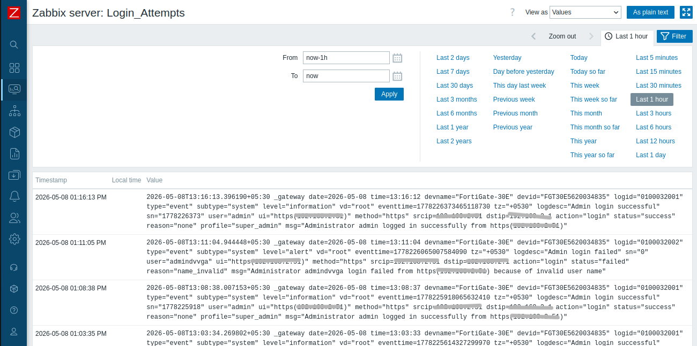
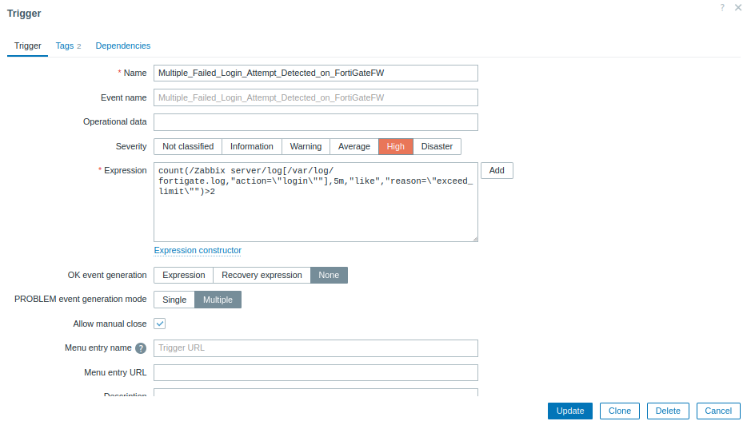
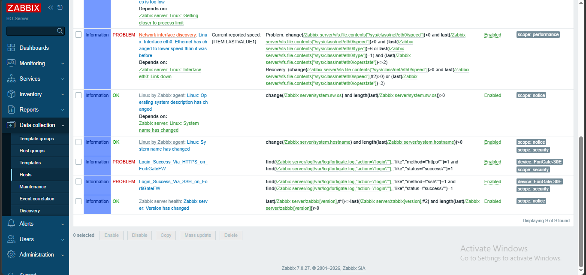

# Creating Items and Triggers in Zabbix

### Overview

This document explains how I create the custom items and triggers.

When we adding a host to the zabbix system and link that host to specific template it comes with default items and triggers.

In my project I create syslog server to collect logs from devices as exmaple i use FortiGate firewall. So these logs are recived from the linux vm which the server i used as syslog server using "Rsyslog" utility.

So, i create one item on server which is also the zabbix server, for collecting that syslog events and using that item I create serveral triggers as my requirements.

#### step 1: Create an Item

First I setup the syslog server and verified it recieved the logs or not.

Then from the zabbix UI, create an item using the log recived to the server and get those to the zabbix DB.

Navigate to the Data collection > Hosts > Items > Create item

Then we need to given a specific name to the creating item and I choose the type as Zabbix agent (active) becuase we need to moitor the logs. (More info --> https://www.zabbix.com/documentation/current/en/manual/config/items/itemtypes/zabbix_agent/log_items)

Also when creating the item we can configure interval time we need to read the logs and how long the data DB sotres like things.

Following screenshots shows the item configurations and recived data from that created item.

Initially I only get the logs which are related to the login informations.

#### Step 2: Creat triggers

After creating the item, I created several triggers based on my requirements. I want to capture the login attempts form GUI and SSH and both the failed and successfull ones. Also, I create multiple loggin attempts fails trigger to capture it becuase it can be security breach.

Navigate to the Data collection > Hosts > Triggers > Create trigger

In the new trigger creation interface, we can give specific name to it and can defined the severity level and need to give expression (About expression can find out from the zabbix documentation user manual) which is activate and deactivate the trigger and have some serveral configurations on this interface. (More info --> https://www.zabbix.com/documentation/current/en/manual/config/triggers)

Following screenshots provide some triggers i created and configuration interface of trigger.

In following screanshot last two triggers before the last trigger are custom ones.

### Troubleshooting

If item is not collecting data, check the followings;

  - Network connectivity
  - Host availability
  - Zabbix agent status of the host
  - Item key configurations

And also when your item get logs from linux log file, make sure that zabbix user has the permissions to read that file.

If trigger is not activating, check the followings;

   - Item is collecting data or not
   - Trigger expression is correct
   - Trigger is enabled
   - Item data type is correct ( if we get log the type is log)
   - Required data is availabe or not

### Notes

The item and trigger creation is cary depending on the;

   - Zabbix cersion
   - Divice type
   - Monitoring method
   - Syslog message format
   - Security requirements
