## Slack Notification System

### Overview

This document demonstrates how I integrate NMS with slack notification system

---

Basically I use script method for creating media type for slack notification intrigation. Also we can use webhook type but it is some what complex that this.

#### step 1: Creating Slack channel

Configuring the slack application, first we need a workspace on slack application.

Then I create a channel called zabbix_alerts

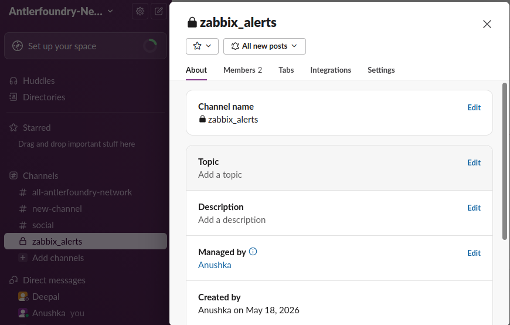

Then, I created a app using the adding app option from slack UI.

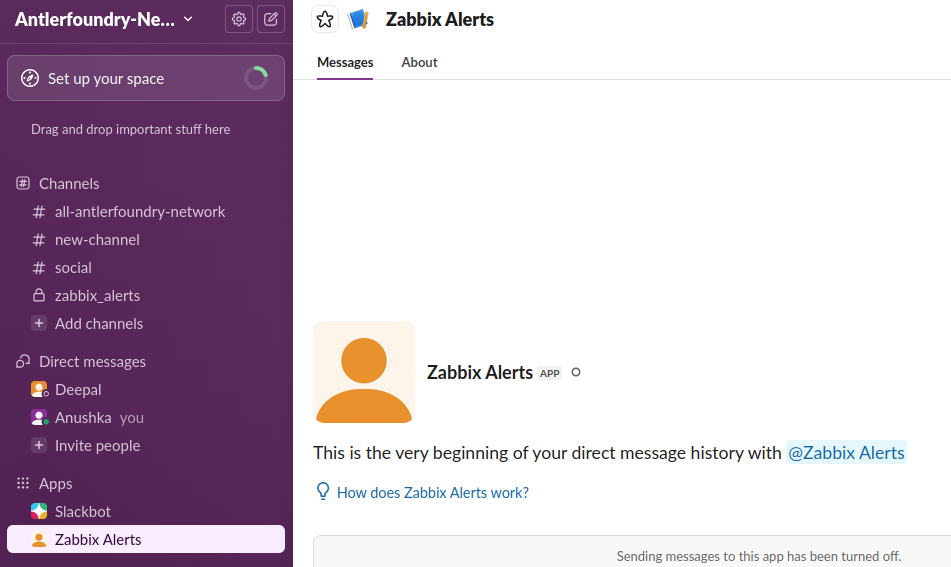

Then, click zabbix Alerts About > Configuration > build > select the app, then we get following interface

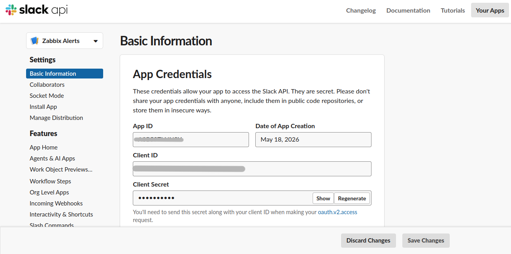

In here, we have to give permission to our bot to write in the channel. so firstly, we have to go to the “OAuth & Permissions” tab.

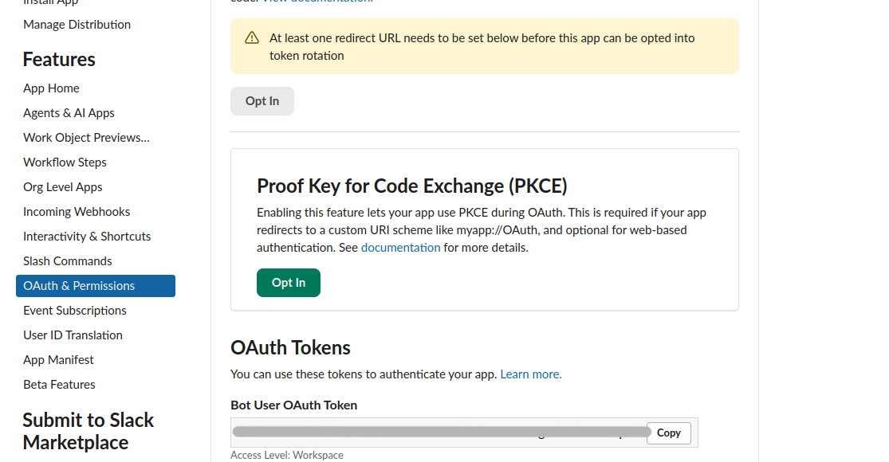

Then under “scope” we need to add the OAuth Scope as our need.

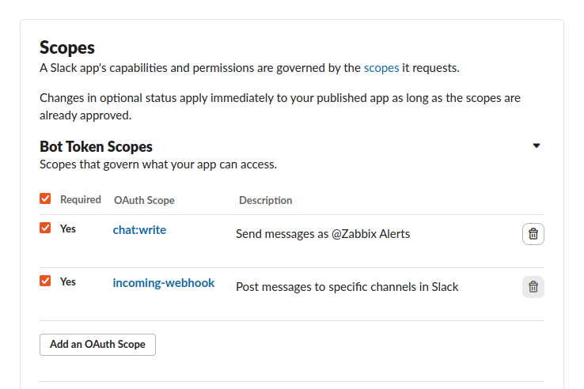

Then we need to reinstall this bot to our workspace.

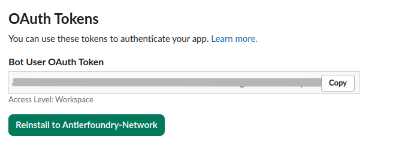

We need to note this token because it is used in the script.

Then, we need to verify the bot is actually is in our channel by adding it like following.

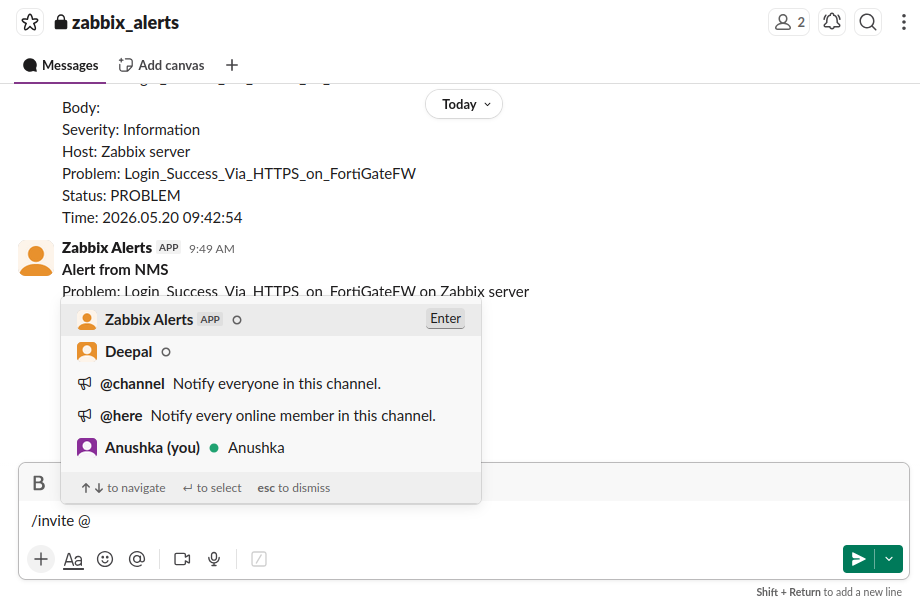

#### Step 2: Creating script to send alerts via slack

we need to create a script for the slack media type. The script should be place under the correct path as configuring in the “zabbix_server.conf”. default path is —> /usr/lib/zabbix/alertscripts.

used slack script as follows;

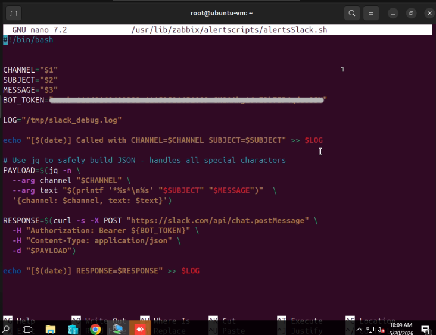

Then we need make it as executable and give correct permissions to it.

---
sudo chmod +x /usr/lib/zabbix/alertscripts/slack_notify.py
sudo chown zabbix:zabbix /usr/lib/zabbix/alertscripts/slack_notify.py
---

The restart the zabbix server

#### step 3: Create the media type and done other configuration in zabbix UI

In zabbix web UI, we first need to create media types.

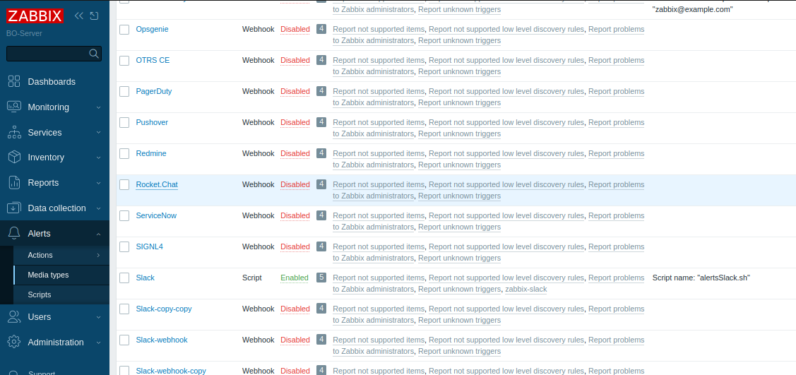

In the slack media type we need to configure it as follows

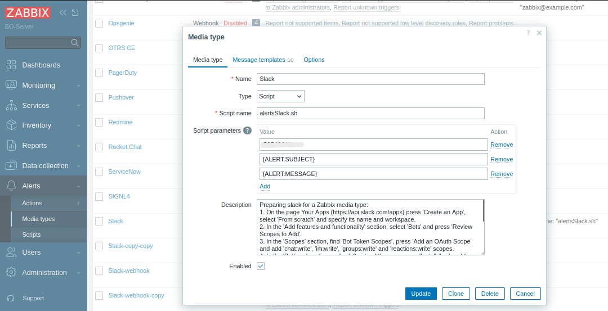

Channel id we can found under channel information in slack UI. in type field we need to select script and for script name we need to write the script name we use in the server.

It should be enable, and we can test it from here.

If any triggers are sets, we can see whether zabbix sends the alerts from this media type. we can verify actually the zabbix are sending the alerts to define media. path Report > Action Log

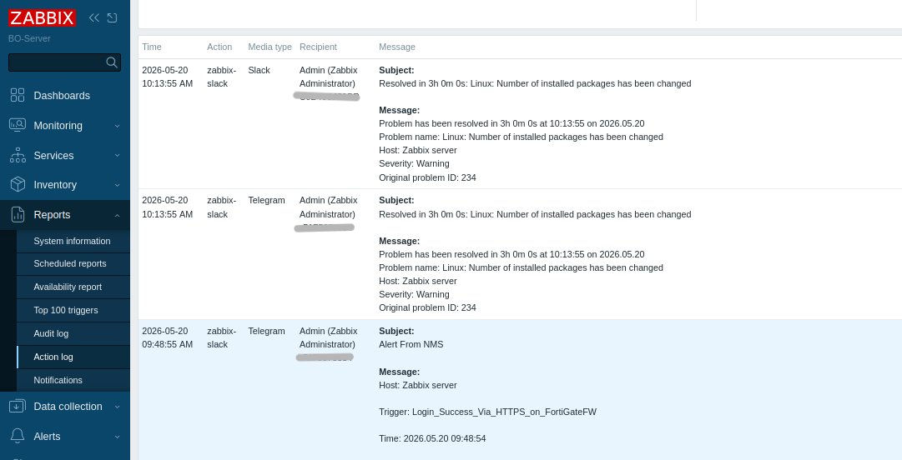

Then we need to create the user and adding the media type for that user. path —> users > user > media. The relevent screenshots are providing below;

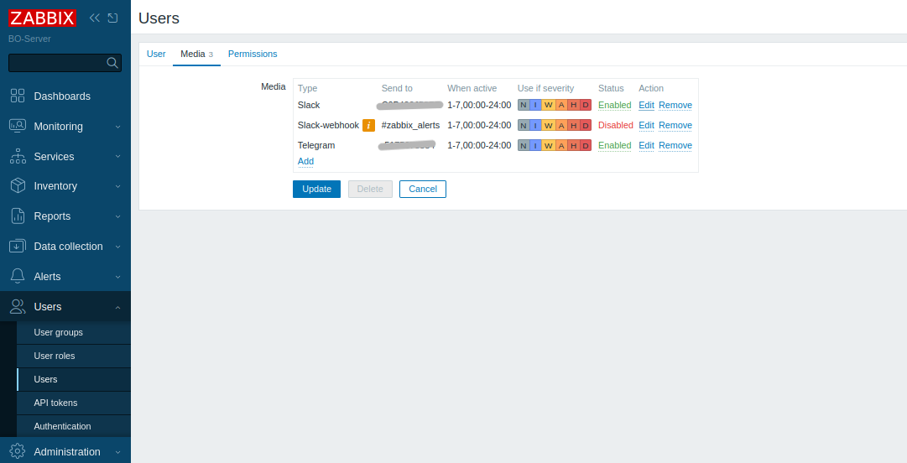

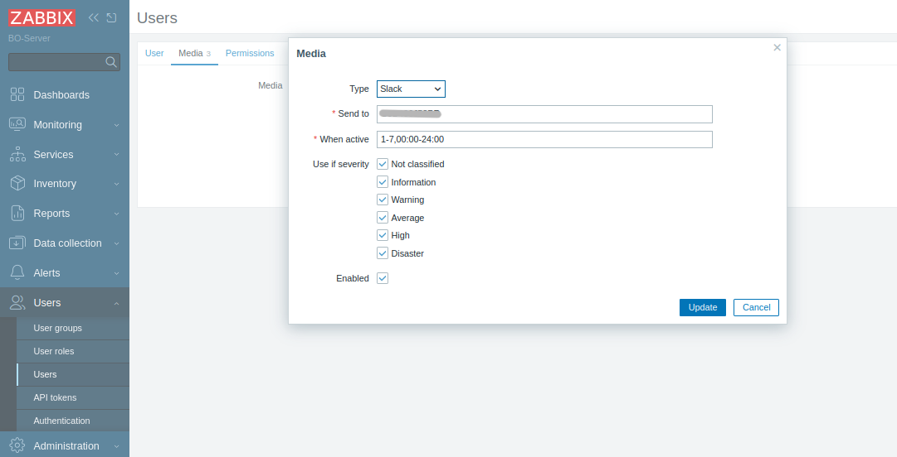

Note: These users can be use to set specific alerts to the slack notification system. Also the classification level can be configured from this.

Then, from alerts we can set action triggers. path —> alerts > action triggers

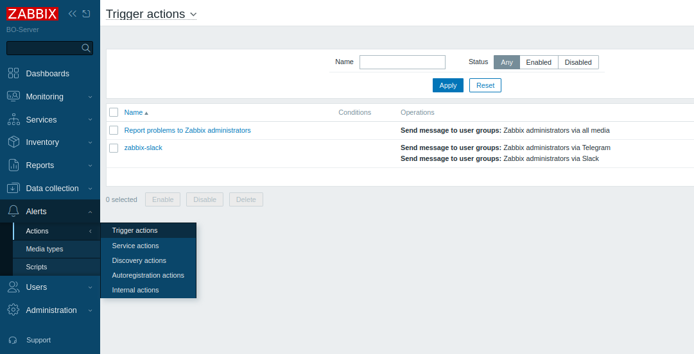

We can create actions and can add the operations to it.

When adding operations, we need to add the correct user and also the message format represents the notification format we received. Also we must choose the correct media type.

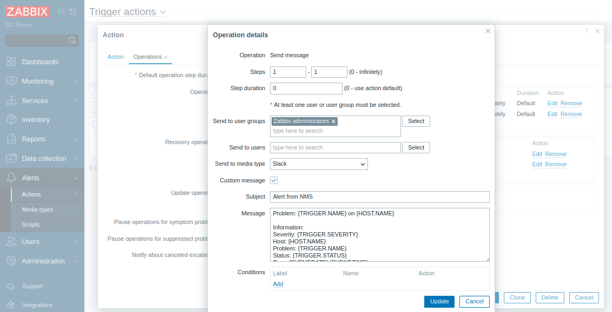

Also when we adding operations we need to add recovery operation too. also the the step duration need to change according to our need.

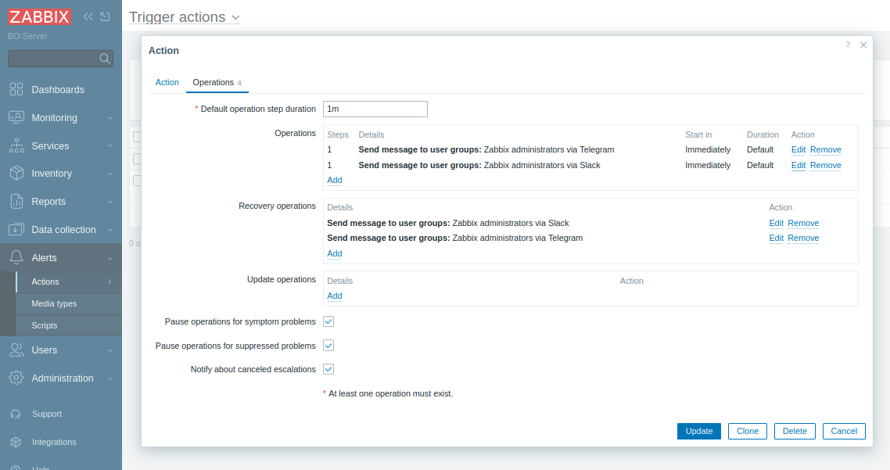

without settingup recovery actions, it not sends the resolve messages to the Slack.

### Troubleshooting

