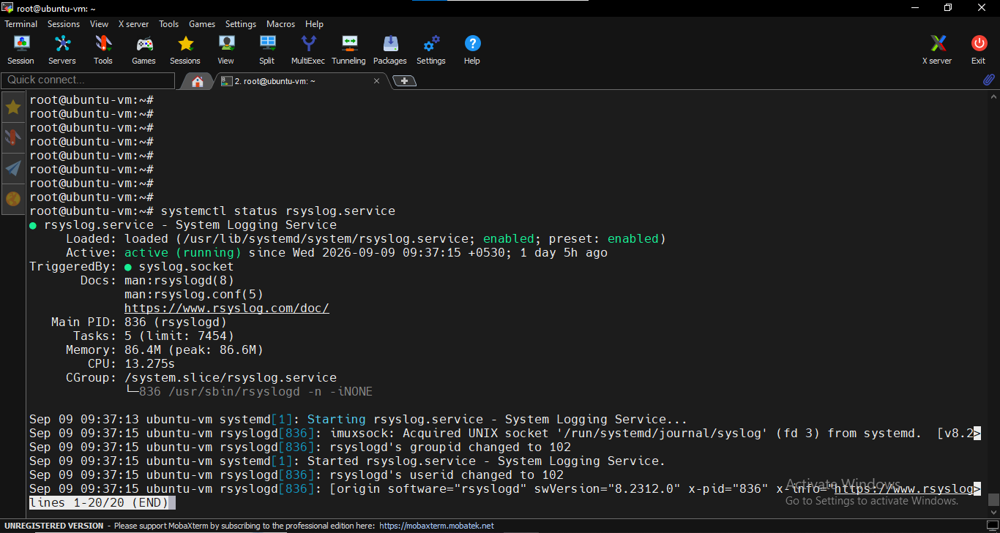
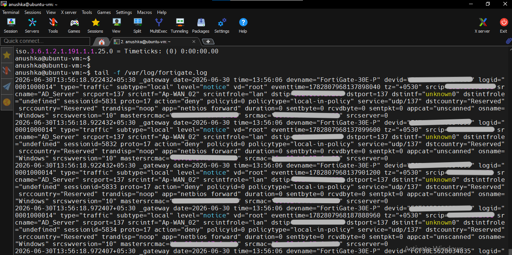
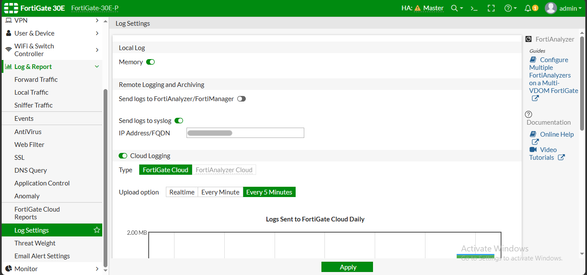

## Installation of Zabbix and Syslog

This document explain how can we do the installation process of the zabbix and syslog server.

### Zabbix Instalation

For installing zabbix i followed the official installation process provide by the zabbix.

Link --> https://www.zabbix.com/download

From thire we can select the zabbix version to installed, OS distribution we used, OS version, zabbix components we want to install, database and the web server.

After selecting those as requirements, we can follow the zabbix installation process they provided.

## Syslog Server Setup

First we need to install a syslog utility like ***Rsyslog*** or ***Syslog-ng***. For my setup I used ***Rsyslog*** and use command "apt install rsyslog" to install it.

Then I use a script on Rsyslog to send the FW logs to seperate file one *** /var/log/*** directory. That script use the firewall ID to identify the logs and then save it in *** /var/log/*** directory.

Then I verify whether the logs are recieving or not by looking to the log file.

Then using this log file I created the item on the NMS.

Also, in the firewall end, we need to enable the syslog by adding the ip address of the server.

